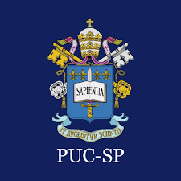

# 🔐 PUC-SP AutoLogin Extension

A sleek and privacy-conscious Chrome extension that stores your **RA** and **Senha** locally, enabling **automatic login** to the [PUC-SP Portal](https://portal.fundasp.org.br/FrameHTML/web/app/edu/PortalEducacional/login/).

  

## ✨ Features

- ✅ Save your **RA** and **Senha** securely using `chrome.storage.local`
- 🔄 Autofill login credentials automatically when visiting the portal
- 🎚️ Toggle on/off auto-fill behavior with a clean animated switch
- 🎨 Beautiful popup interface using custom CSS

## 📸 Preview
to be made
<!--  -->

## 📁 File Structure

PUCLogin/
├── public/
│ └── puc-main.png
├── src/
│ ├── main.html # Popup UI
│ ├── main.css # Custom styling
│ └── input.js # Autofill + toggle logic
├── manifest.json # Chrome extension config
└── README.md # This file

## 🔧 How to Use (Dev Mode)

1. Clone or download this repository.
2. Open **Chrome** and go to `chrome://extensions/`.
3. Enable **Developer Mode** (top right).
4. Click **“Load unpacked”** and select the extension folder.
5. Click the extension icon to test the popup.
6. Visit the login portal and enjoy autofill!

## 🔐 Privacy First

All data is stored **locally** on your browser using `chrome.storage.local`.  
No external servers, no trackers, no data leaks.

## ✅ Permissions Used

- `"storage"`: To save your RA and password.
- `"activeTab"`: To access the currently open tab (optional in future features).
- `"scripting"`: To potentially inject scripts into the login page.

## 📜 License

Unlicense license

---

Made with PUC-SP students in mind.